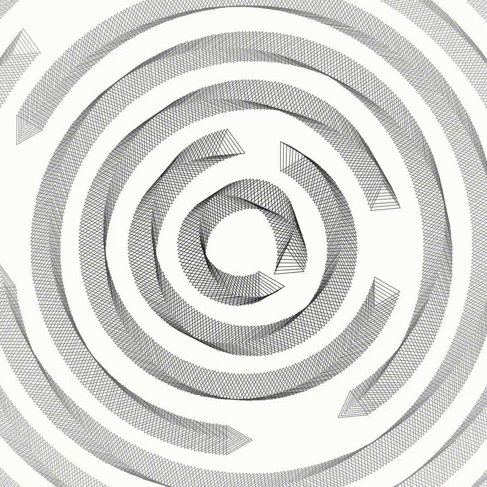
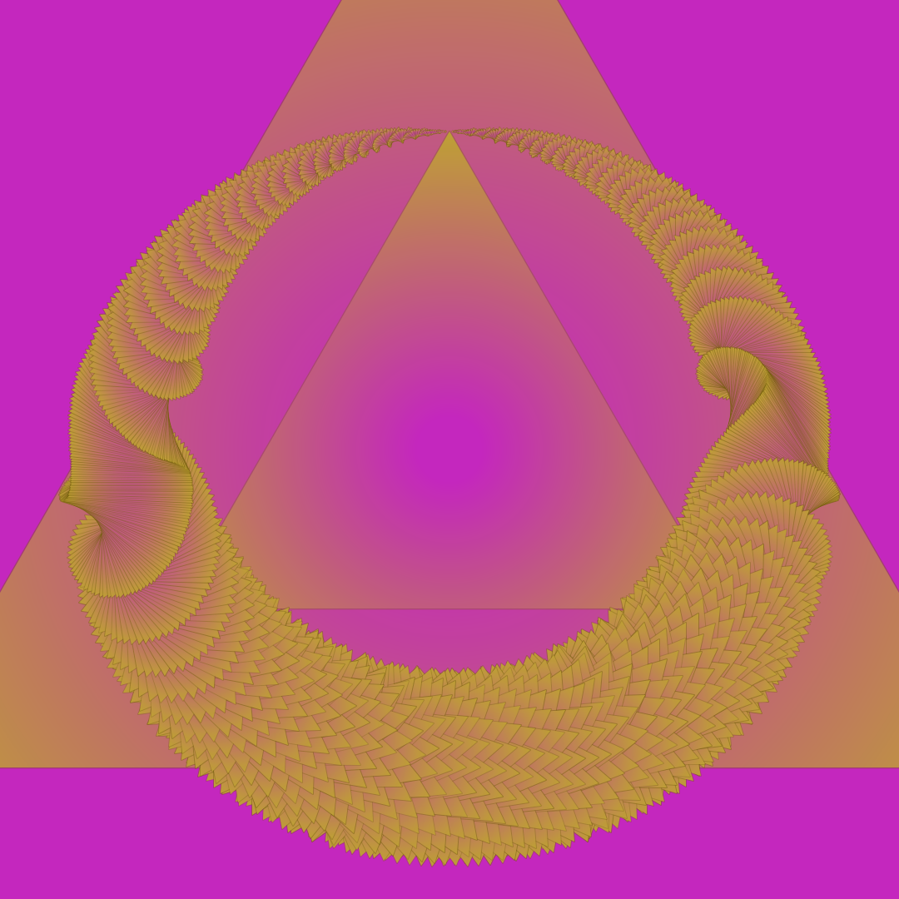
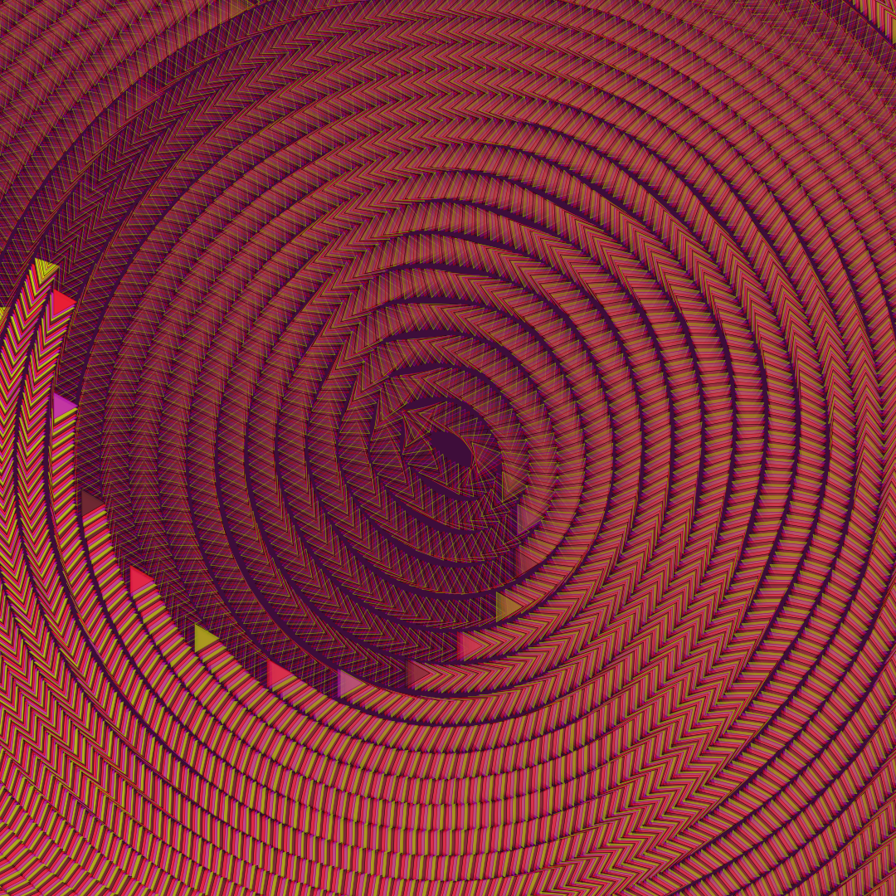

# Reactor

Reactor is a NodeJS framework for procedurally generating large-scale art and visualizing it on mockups of physical objects. It contains a powerful library for painting with shapes and images, allowing you to control a variety of visual properties, both stochastically and parametrically.

