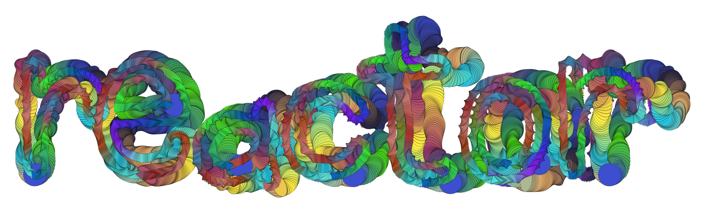
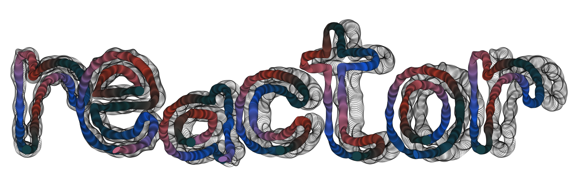
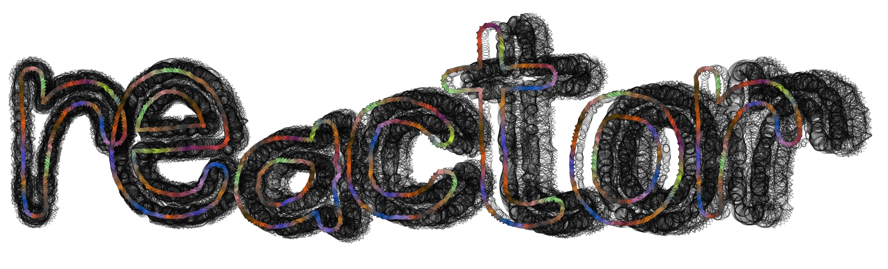
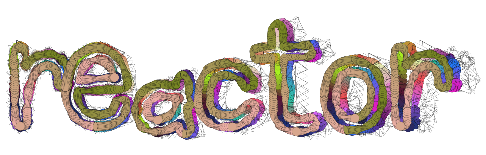
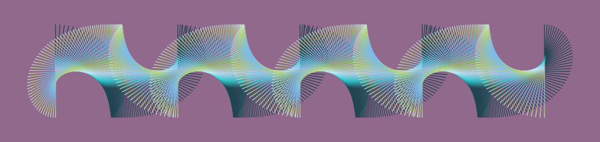
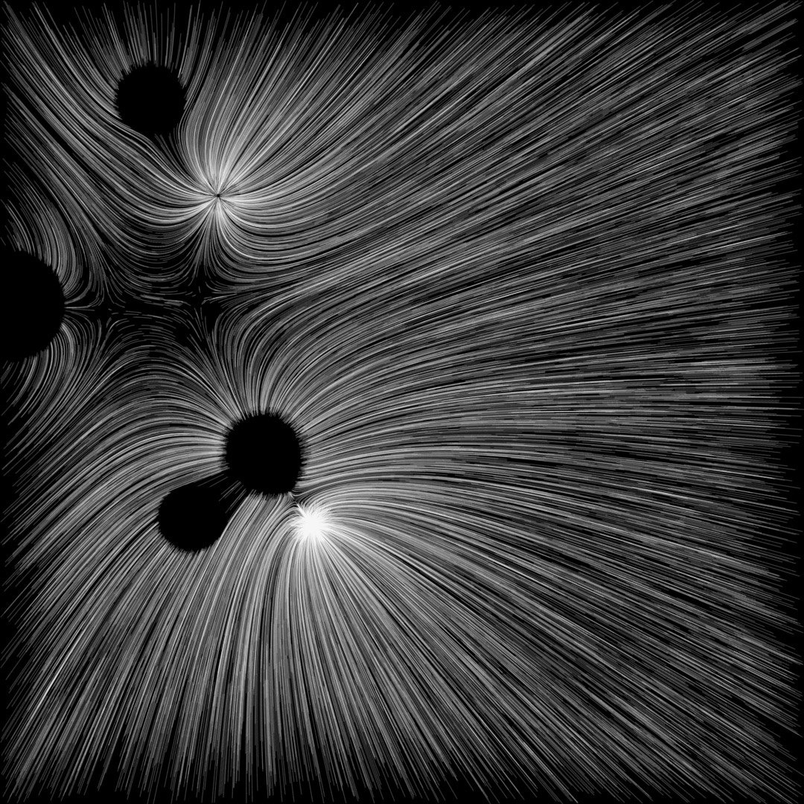
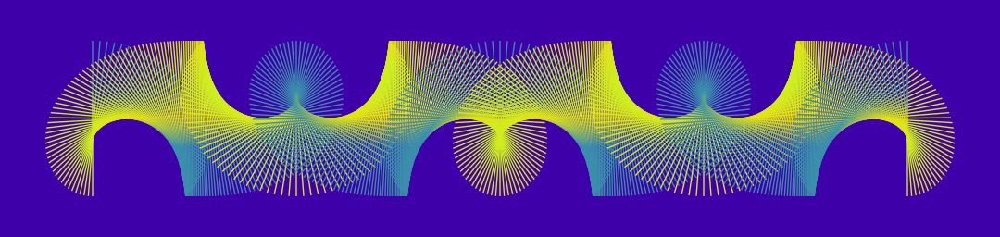
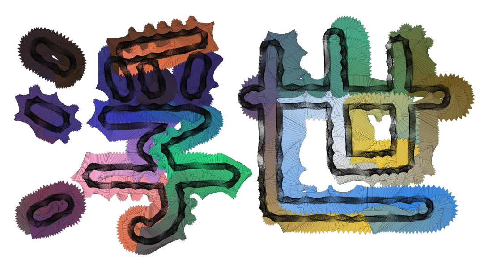
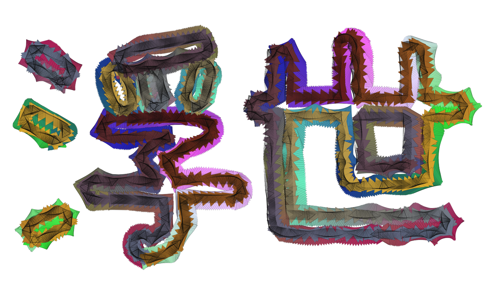
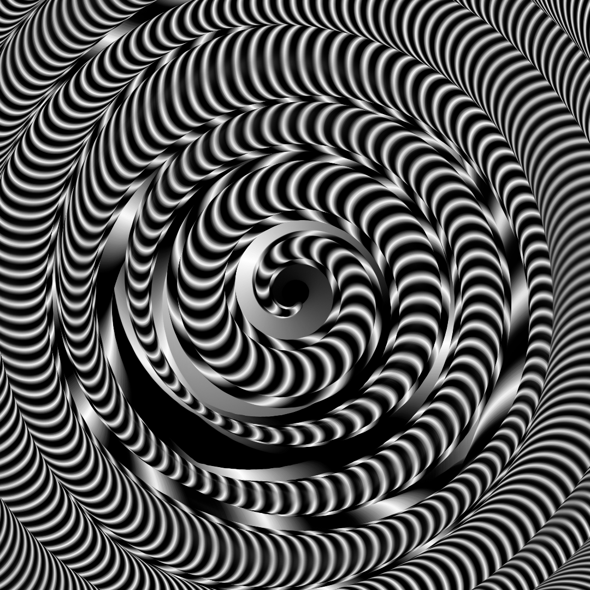

# Reactor

Reactor is a NodeJS framework for procedurally generating large-scale art and visualizing it on mockups of physical products. It comes with a powerful toolkit for painting brushstrokes of images and shapes, letting you control a large array of visual properties with hard-coded parameters, random ranges, sample sets, and parametric functions.

[**The source code can be found here.**](https://github.com/superginyuforce/reactor) **To request access, e-mail daniel@artfactory.io. We don't grant access to just anyone, but we're open to inquiries and collaboration.**

### 

### Random Outputs...

