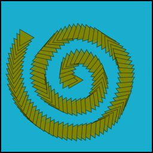
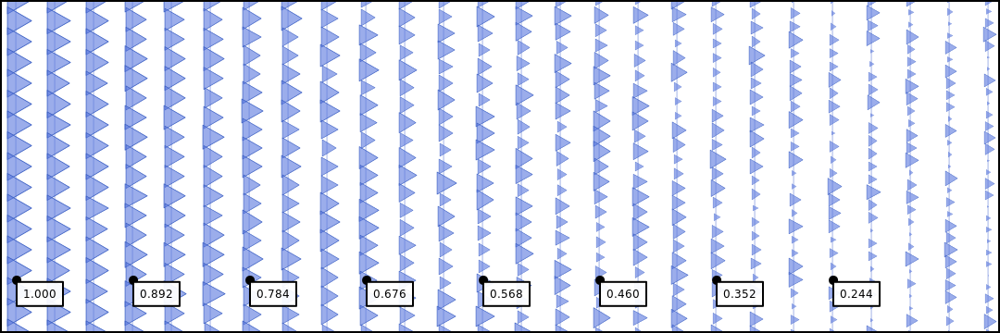
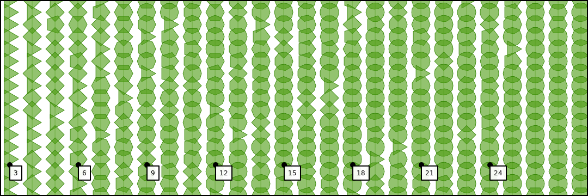
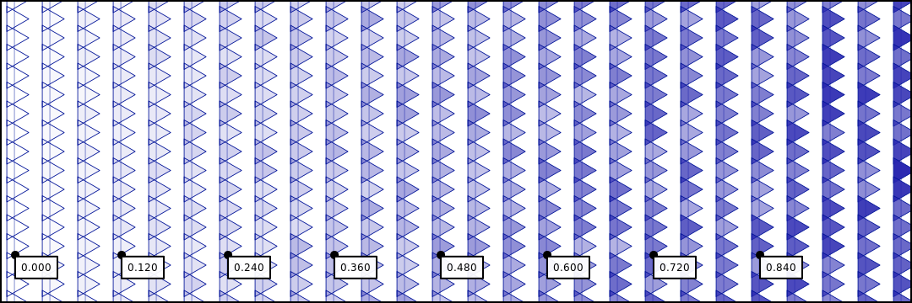
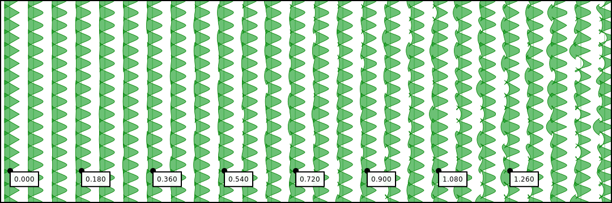
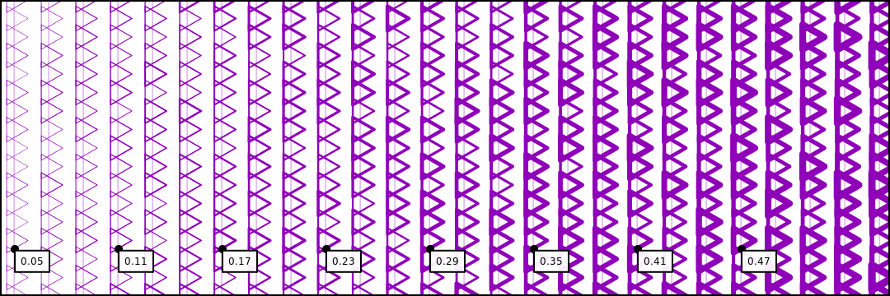

# Reactor

Reactor is a NodeJS framework for procedurally generating large-scale art and visualizing it on mockups of physical objects. It contains a powerful library for painting with shapes and images, allowing you to control a variety of visual properties, both stochastically and parametrically.


## Table of Contents

* [Painting with Images & Shapes](./#paint)
  * [General Brush Dynamics](./#brush-dynamics)
  * [Shape Dynamics](./#shape-dynamics)
  * [Image Dynamics](./#image-dynamics)
  * [Brushstrokes](./#brushstrokes)
* [Getting Started](./#getting-started)
* [Design Reproducibility](./#design-reproducability)
* [Getting Your Designs on Mockups](./#mockups-overview)
* Guides
  * [How Brushes Work](./#tutorials-how-brushes-work)
  * [Iterating on Designs](./#tutorials-iterating-designs)

## [Painting with Images & Shapes](./)

Reactor contains a powerful library for using shapes and images as brushes. A wide array of brush properties can be controlled programmatically, using combinations of constant values, random variables, and parametric functions. At a basic level, the process of creating and using a brush looks like this:

```javascript
import { Brush } from 'reactor'

const brush = new Brush({type: 'shape', density: 1.0, radius: 0.05})
const line = {type: 'line', start: [0, 0], end: layer.size}

brush.paint(layer, line)  // paint a diagonal line
```

The meaning of `density` and `radius` in this example are explained below.

### [Brushstrokes](./)

The path followed by a brush can be one of several things, including points, lines, rings, spirals, and arbitrary sequences of points. There are two call conventions you can use. For example, either of the following is acceptable:

```javascript
brush.paint(layer, {type: 'line', start, end})
```

or...

```javascript
brush.paintLine(layer, start, end)
```

#### [Brushstroke Types](./)

Here is an overview of the available brushstrokes \(as of writing\):

**Lines**


* Type: `"line"`
* Call: `brush.drawLine(layer, start, end)`
* Parameters:
  * `start` - line segment starting point
    * Examples: `new Vector(x, y)`, `[x, y]`,  `{x, y}`
  * `end` - line segment end point
    * Examples: `new Vector(x, y)`, `[x, y]`,  `{x, y}`

**Rings**


* Type: `"ring"`
* Call: `brush.drawRing(layer, center, radius, angle)`
* Parameters:
  * `center` - ring center point
    * Examples: `new Vector(x, y)`, `[x, y]`,  `{x, y}`
  * `radius` - ring radius as numeric percent of target layer radius
    * Example: `0.50` \(50% layer radius\)
  * `angle` - angle in radian at which initial point in stroke is drawn
    * Example: `2/3 * Math.PI`
    * **Spiral**

      
* Type: `"spiral"`
* Call: `brush.drawSpiral(layer, center, radius, angle, coils)`
* Parameters:
  * `center` - ring center point
    * Examples: `new Vector(x, y)`, `[x, y]`,  `{x, y}`
  * `radius` - ring radius as numeric percent of target layer radius
    * Example: `0.50` \(50% layer radius\)
  * `angle` - angle in radian at which initial point in stroke is drawn
    * Example: `2/3 * Math.PI`
  * `coils` - number of levels or coils in the spiral
    * Example: `2.5`

**Points**

* Type: `"point"`
* Call: `brush.drawPoint(layer, point)`
* Parameters:
  * `point` - point at which the brush is drawn
    * Examples: `new Vector(x, y)`, `[x, y]`,  `{x, y}`

**Path**

* Type: `"path"`
* Call: `brush.drawPath(layer, path)`
* Parameters:
  * `path` - sequence of points traversed by the brush
    * Examples: `[new Vector(x, y)]`, `[[x, y]]`,  `[{x, y}]`

### [Dynamic Brush Properties](./)

When initialized, each brush computes core parameters that do not vary between brushstrokes -- like density, radius, and angle of rotation. Other properties are computed for each brushstroke. For example, the image below was generated with a single "triangle" brush, laying down vertical brushstrokes. The color, radius, density of the brush are updated between strokes.


In what follows is an overview of the dynamic brush properties available.

#### Density

* **Definition**: number of shapes drawn per unit length
* **Units**: percentage of computed brush radius
* **Type**: `float`


#### Radius

* **Definition**: approximate radius of the polygon
* **Units**: percentage of canvas radius, i.e. `sqrt(canvas.width^2 + canvas.height^2) / 2.0`
* **Type**: `float`


#### Angle

* **Definition**: clockwise angle of rotation
* **Units**: radians, i.e. `0` through `2 * Math.PI`
* **Type**: `float`


### [Dynamic Brush Shape Properties](./)

These properties control the rendering of the brush at each point along its path. In the images below, each label denotes the upper bound on the values possibly assigned to the property under consideration at every third point along the x axis.

#### Horizontal Scattering

* **Definition**: magnitude of random positional offset along the `x` axis
* **Units**: percentage of computed brush radius
* **Type**: `float`


#### Vertical Scattering

* **Definition**: magnitude of random positional offset along the `y` axis
* **Units**: percentage of computed brush radius
* **Type**: `float`


#### Scale

* **Definition**: size, relative to computed brush radius
* **Units**: percentage of computed brush radius
* **Type**: `float`



#### Polygon Edge Count

* **Definition**: the number of edges on the drawn polygon
* **Units**: number of edges
* **Type**: `int`



#### Polygon Angle

* **Definition**: the number of edges on the drawn polygon
* **Units**: number of edges
* **Type**: `int`


#### Fill Color

* **Definition**: the color with which the polygon is filled, not including alpha
* **Units**: color
* **Type**: [ChromaJS](https://gka.github.io/chroma.js/) color object, color hex string, etc.


#### [Fill Alpha](./)

* **Definition**: transparency level of the fill color
* **Units**: percentage, from `0.0` through `1.0`
* **Type**: `float`



#### Edge Waviness

* **Definition**: magnitude of polygon edge curviness, using random Bezier curves
* **Units**: real number, `0.0` or higher
* **Type**: `float`



#### Fill Composite Mode

* **Definition**: composite operation applied when filling the shape
* **Units**: [a valid canvas API composite operation](https://developer.mozilla.org/en-US/docs/Web/API/Canvas_API/Tutorial/Compositing)
* **Type**: `string`


#### Stroke Width

* **Definition**: line width of stroke
* **Units**: percentage of computed shape radius
* **Type**: `float`



#### Stroke Color

* **Definition**: the color with which the polygon is stroked, not including alpha
* **Units**: color
* **Type**: [ChromaJS](https://gka.github.io/chroma.js/) color object, color hex string, etc.


#### Stroke Alpha

* **Definition**: transparency level of the stroke color
* **Units**: percentage, from `0.0` through `1.0`
* **Type**: `float`


#### Stroke Composite Mode

* **Definition**: composite operation applied when stroking the shape
* **Units**: [a valid canvas API composite operation](https://developer.mozilla.org/en-US/docs/Web/API/Canvas_API/Tutorial/Compositing)
* **Type**: `string`


### Defining Dynamic Properties

Dynamic Brush properties can be defined and combined in a number of ways, including the use of constant values, random variables, and parametric functions. Here is a example of setting polygon [fill alpha](./#fill-alpha) in each way:

**Constant Value**

```javascript
new Brush({
  type: 'shape',
  shape: {
    fill: {
      alpha: 0.5
    }
  }
})
```

**Random Variable**

```javascript
new Brush({
  type: 'shape',
  shape: {
    fill: {
      alpha: {min: 0.25, max: 0.5}
    }
  }
})
```

**Parametric Function**

```javascript
new Brush({
  type: 'shape',
  shape: {
    fill: {
      alpha: (i, j, n, m) => 0.25 + 0.25 * (i / n)
    }
  }
})
```

## [Getting Started](./)

The first thing you'll want to do is create a Design and save it to file. To do this, implement a `Design` subclass. Here is an example of a design, which simply fills the canvas with blue:

### Create a Design

```javascript
/** BlueDesign.js */
import { Design } from 'reactor'

class BlueDesign extends Design {
  async load() {
    // async load and store global static assets here, like images
  }

  draw(layer, scale = 1.0) {
    // arbitrary drawing logic, where `layer.ctx` is a node-canvas 2D context
    layer.ctx.fillStyle = 'blue'
    layer.ctx.fillRect(0, 0, layer.canvas.width, layer.canvas.height)
  }
}
```

### Drawing Your Design on a Canvas

The render the design, you'll want to define a canvas on which to draw it. In Reactor, each canvas is managed by an instance of the `Layer` class. Think "layers" in Photoshop. Furthermore, collections of layers are managed by instances of the `Artist` class.

```javascript
/** example.js */
import BlueDesign from './BlueDesign'

export default async function() {
  const design = new BlueDesign()

  // create an artist which manages layers
  const artist = new Artist({w: 512, h: 512})

  // create layer called "background" 
  const layer = artist.createLayer('background')

  // render the design on the "background" layer
  await layer.drawDesign(design)

  ... // continued below
```

### Save the Rendered Image

The contents of a layer's canvas can be saved to disk in the form of a JPEG, PNG, SVG or other format. A layer can be saved either through its own `save` method.

```javascript
  // continued from example.js above...
  // saving via layer (with optional image config object)
  await layer.save('/path/to/output/background.png', {compressionLevel: 6})
}
```

#### Saving "all" via Artist

In addition to saving this layer by itself, uou can save this layer along with its sibling layers, by calling `save` on an artist. The artist will use the name of each layer as a file name. For example:

```javascript
// saving this layer (and all other layers) via artist
await artist.save('/path/to/outpout', {compressionLevel: 6})
```

### Running the Program

Finally, you can run this program by creating a file containing the following preamble, which sets up application state through a global `Reactor` object:

```javascript
/** main.js */

import example from './example'

async function main() {
  // global singleton, which manages internal state of the application
  const reactor = Reactor.getInstance()

  // recursively load static assets, used by designs, products and mockups
  await reactor.load()

  // run the example program!
  await example()
}

main()
```

## [Design Reproducibility](./)

For reproducing designs with randomness, you'll want ensure that your draw method produces the same visual output for the same input parameters. In other words, the design's draw method should be idempotent. For your convenience, each `Artist`, `Layer`, and `Design` has its own seedable pseudo-random number generator \(PRNG\). This means that, given a particular seed value, the generator will always produce the same sequence of "random" values -- including ints, floats, colors, etc. You can achieve basic reproducibility by including a seed value in parameters and setting it on your design's PRNG.

```javascript
class MyDesign extends Design {
  /**
   * Fill the canvas with a predictably random color
   */
  async draw(layer, scale = 1.0) {
    // set the PRNG seed value for reproducable randomness
    this.random.seed = this.params.seed

    // fill colored rect
    layer.ctx.fillStyle = this.random.color()
    layer.ctx.fillRect(0, 0, ...layer.size)
  }
}
```

## [Getting Your Designs on Mockups](./)

A _mockup_ is an image of a physical object upon which one or more designs is rendered. Some mockups are complex, involving multiple composited sub-images or _slices_ -- for example, a shirt with distinct designs for the front and each sleeve. Others mockups are more simple, like a mockup for a tapestry using a single slice. In addition to rendering the image of the object itself, mockups can define parameters that control the manner in which slices are rendered for print media, typically as large, high-resolution images.

### Mockup Components

The definition of a mockup in code consists of several parts: 1. **name** - name of the mockup used at runtime 2. **size** - composite output image size 4. **slices** - distinct parts composited into the final image, like, left sleeve, collar, etc. 3. **images** - image resources

* **background images** - images behind the mockup object, like a beach, body of a model, etc.
* **foreground images** - images in front the mockup object, like smoke, lighting, etc.

### Rendering Mockups

Rendering a mockup is easy. Here is what the process looks like at a high level:

```javascript
// get a "wall hanging" mockup from initialized reactor
const mockup = reactor.getMockup('wallHanging')

// render the mockup, returning artist with composite layer, named "mockup"
const artist = await mockup.render({
  // style directives for the "front" slice:
  front: {
    design: {
      type: 'MyDesign',
      params: {
        seed: 123,
        color: '#f9c',
      }
    }
  }
})

// save the mockup layer's canvas to file
await artist.getLayer('mockup').save('./mockup.png')
```

### Creating Mockups

In overview, mockup parameters are provided in the form of a plain ol' object, which can be stored and loaded from JSON or YAML, making it easier to register new mockups without writing more code. Here is a simple examples of a mockup for a hypothetical T-shirt.

```javascript
import { Mockup } from 'reactor'

const mockup = new Mockup({
  name: 'shirt',
  size: {w: 1080, h: 1080},
  images: {
    background: [{src: 'bg.png'}],
    foreground: [{src: 'fg.png'}],
  },
  slices: [
    {
      name: 'front',
      // location of slice image file and its top-left position
      // within the mockup canvas area:
      image: {
        src: 'front.png',
        position: {x: 217, y: 42},
      },
      // parameters used in generating print files:
      file: {
        inches: {w: 20, h: 36}
      },
      // static style directives, like filling the slice
      // with blue:
      style: {
        fill: 'blue',
      }
    },
  ]
})
```

