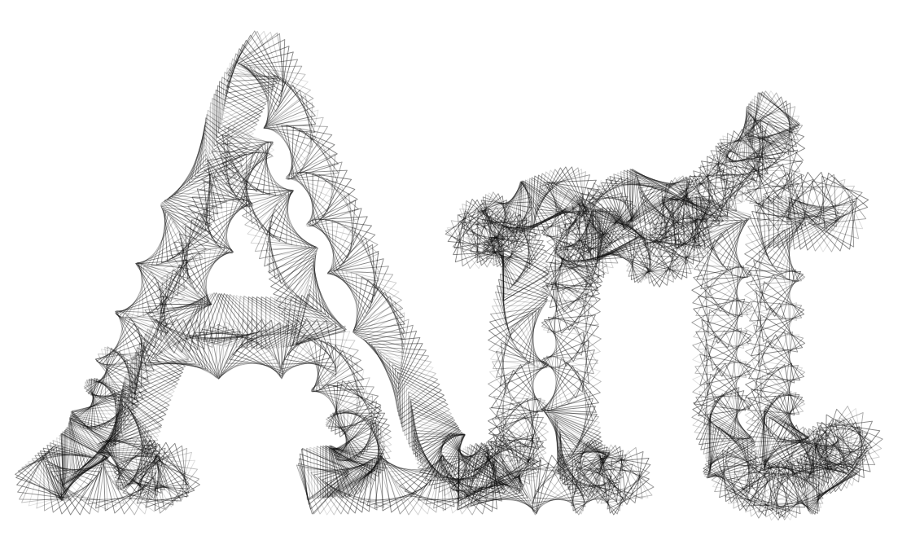

# Reactor

Reactor is a NodeJS framework for procedurally generating large-scale art and visualizing it on mockups of physical objects. It contains a powerful library for painting with shapes and images, allowing you to control a variety of visual properties, both stochastically and parametrically.

[**The source code can be found here.**](https://github.com/superginyuforce/reactor) **To request access, e-mail daniel@artfactory.io. We don't grant access to just anyone, but we're open to inquiries and collaboration.**

### Random Outputs...

