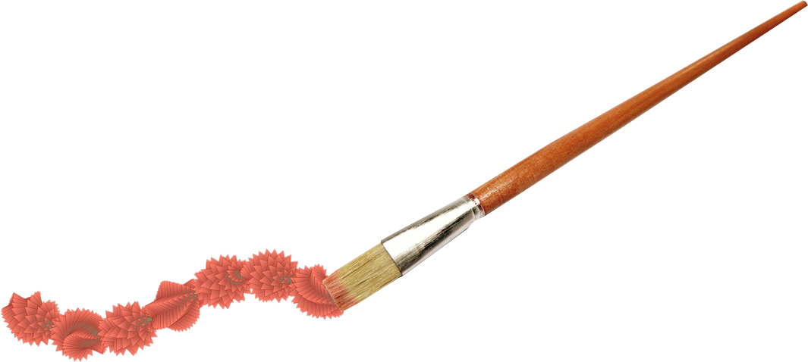

# Brushes

Brushes let you use shapes, images, and other geometric primitives to paint. You can control every aspect of the brush — like angle, scale or color — using custom combinations of constants, random values, and parametric functions. In addition, brushes let you define custom procedures that apply at each point in a brushstroke. The goal of the Brush API is to give you a friendly user-interface for making beautiful, complex art with a handful of elegant geometric and procedural primitives.

### [Brush Parameters](./#brush-parameters)

All brushes inherit certain core parameters that control aspects like the base size, angle, and stroke density of the brush and can be controlled procedurally. Other parameters, however, adhere to the behavior of the brush "tip" at each point in a stroke. The available parameter set differs for each type of brush, but there is often a considerable amount of overlap. 

For example, the `PolygonBrush` has a parameter that controls the number of sides of the polygon, computed at each point in a stroke, while the `LineBrush` has a "line width" parameter. On the other hand, both have a "scale" and "angle" parameter.

### [Brush Types](brush-types/)

Reactor comes with several brush types. Each one corresponds to a different kind of brush tip. For example, there is a brush type that paints with polygons, one that paints with images, etc. Each type inherits the base `Brush` class.

#### [Polygon Brush](brush-types/polygon-brushes/)

Paint with filled and/or stroked triangles, rectangles, hexagons, etc.

// TODO: insert image

#### [Ellipse Brush](brush-types/ellipse-brush/)

// TODO: insert image

#### [Line Brush](brush-types/line-brushes/)

// TODO: insert image

#### [Image Brush](brush-types/image-brushes/)

// TODO: insert image

#### [Glyph Brush](brush-types/glyph-brush/)

// TODO: insert image

