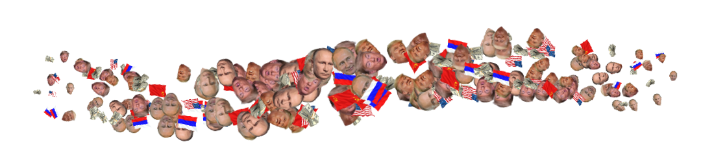
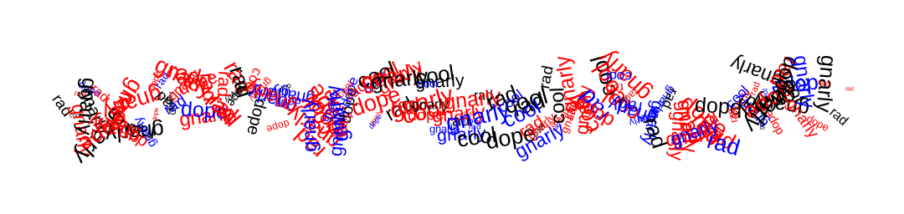

# Brushes

Brushes let you use shapes, images, and other geometric primitives to paint. You can control every aspect of the brush — like angle, scale or color — using custom combinations of constants, random values, and parametric functions. In addition, brushes let you define custom procedures that apply at each point in a brushstroke. The goal of the Brush API is to give you a friendly user-interface for making beautiful, complex art with a handful of elegant geometric and procedural primitives.

### 

### [Brush Parameters](./#brush-parameters)

Every brush inherits certain core parameters that control aspects like its base radius, angle, and stroke density. Other parameters, however, relate to the behavior of the brush "tip" at _each point_ in a stroke. The available set of parameters differs for each type of brush, but there is often considerable overlap. 

For example, the `PolygonBrush` has a parameter that controls the number of sides of the polygon at each point while the `LineBrush` has a "line width" parameter. On the other hand, both have a "scale" and "angle" parameter.


The illustration above of the paintbrush painting a red spiky wave uses a triangular Polygon Brush, filled with a color gradient, using trig functions to control scale, angle and vertical offsets.


### [Brush Types](brush-types/)

Reactor comes with several brush types. Each one corresponds to a different kind of brush tip. For example, there is a brush type that paints with polygons, one that paints with images, etc. Each type inherits the base `Brush` class.

#### [Polygon Brush](brush-types/polygon-brushes.md)

#### [Ellipse Brush](brush-types/ellipse-brush.md)

#### [Line Brush](brush-types/line-brushes.md)

#### [Image Brush](brush-types/image-brushes.md)

#### [Glyph Brush](brush-types/glyph-brush.md)

