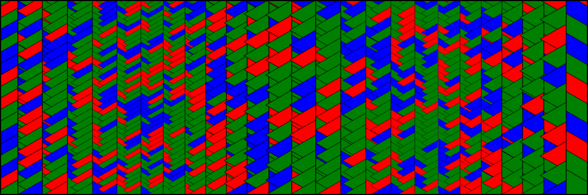

# Brush Properties

When initialized, each brush computes core parameters that do not vary between brushstrokes -- like density, radius, and angle of rotation. Other properties are computed for each brushstroke. For example, the image below was generated with a single "triangle" brush, laying down vertical brushstrokes. The color, radius, density of the brush are updated between strokes.

