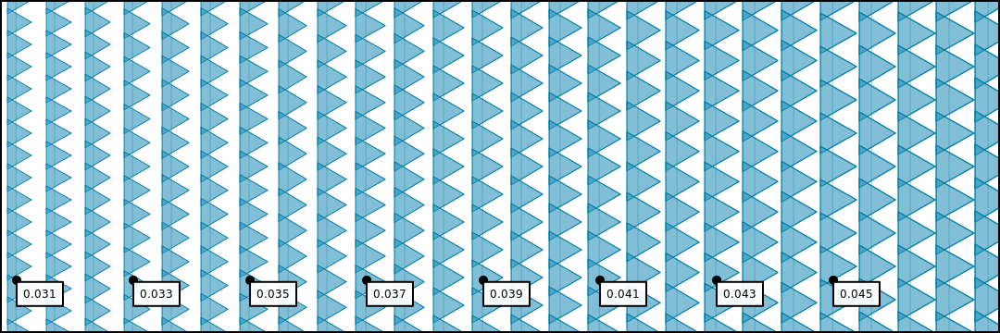

# Radius



The radius of a brush defines how large the brush shape or image is when drawn upon a layer \(and transitively, a canvas\). Radius is expressed as a fraction of the radius of the layer upon which the brush is drawn. The radius of the layer is defined as `sqrt(pow(canvas.width, 2) + pow(canvas.height, 2))`.

### Datatype

* **Units**: Percentage of layer radius
* **Range**: `(0, inf)`
* **Type**: `float`

### Example

```javascript
const brush = new Brush()

// set to constant value of 10% canvas radius
brush.radius = 0.10

// ...or set to random value in range
brush.radius = {min: 0.05, max: 0.15}
```


