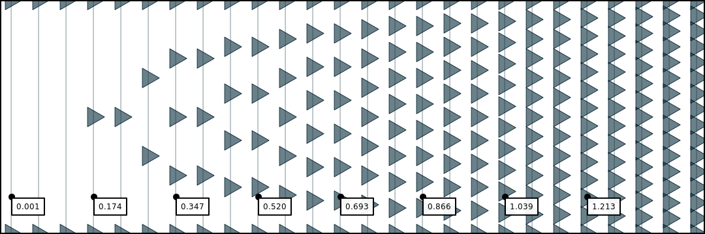

# Density



As density increases, so does the number of points between the start and end points of a brushstroke. Lines, rings, and other paths are calibrated so that a density of `1.0` results in each point being spaced out by an amount equal to the brush's radius.


You can increase the density far beyond `1.0`. Try a larger value, like`10,`and behold!


### Datatype

* **Units**: Percentage of brush radius
* **Range**: `(0, inf)`
* **Type**: `float`

### Example

```javascript
const brush = new Brush()

// set to constant value
brush.density = 1.0

// ...or set to random value in range
brush.density = {min: 0.5, max: 1.5}
```

