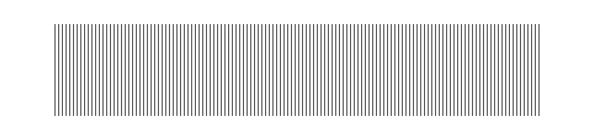
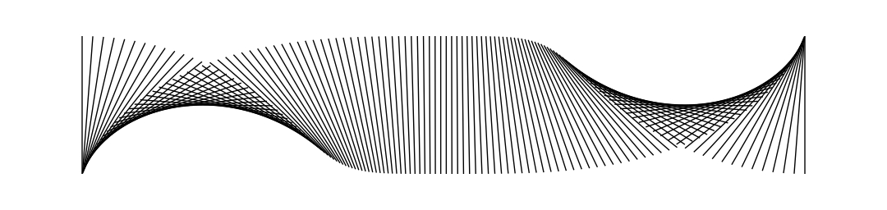
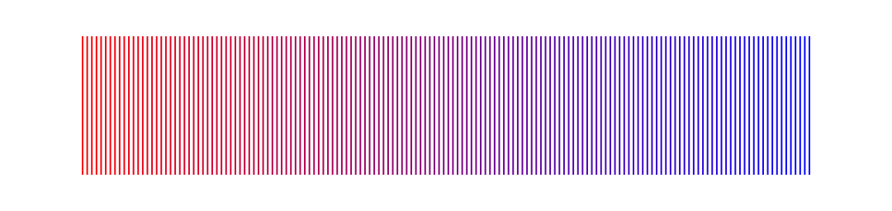

# Line Brush

Line brushes let you paint with — you guessed it — lines! Like other brushes, line brushes have the ability to scale, rotate, reposition, colorize, and blend. Below are a handful of primitive examples that shows what's possible with very little code.

