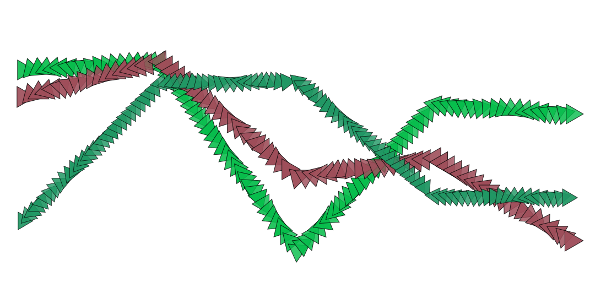

# Linear Splines

Connect a sequence of points using lines, like a line graph.



### Brush Method <a id="overview"></a>

**`paintLinearSplines(layer, points, closed?)`**‌

### ‌Parameters‌‌ <a id="parameters"></a>

1. **points** - sequence of points to stroke
2. **closed** - if `true`, the last point will be connected to the first point

| Name | Type/s | Example/s |
| :--- | :--- | :--- |
| points | `Array<Vector|Array|Object>` | `[new Vector(x, y)]`, `[[x, y]]`, `[{x, y}]` |
| closed | `boolean?` | `true`, `null` |

### Example

#### Paint a horizontal zigzag

```javascript
const n = 4
const dx = layer.width / n
const points = []

// create sequence of endpoints from left to right,
// alternating from top to bottom....
for (let i = 0; i < n + 1; i++) {
    points.push({
        x: i * dx, 
        y: (i % 2) * layer.height
    })
}

brush.paintLinearSplines(layer, points)
```

