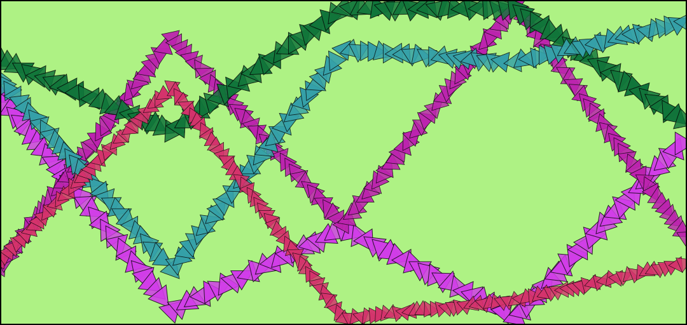

# Linear Splines

Connect a sequence of points using lines, like a line graph.

### Overview‌ 

* **Type Name**: `"linear-splines"`
* **Call Convention**: `brush.paintLinearSplines(layer, points)`‌

### ‌Parameters‌‌ 

1. **points** - sequence of points to stroke
2. **closed** - if `true`, the last point will be connected to the first point

| Name | Type/s | Example/s |
| :--- | :--- | :--- |
| points | `Array<Vector|Array|Object>` | `[new Vector(x, y)]`, `[[x, y]]`, `[{x, y}]` |

