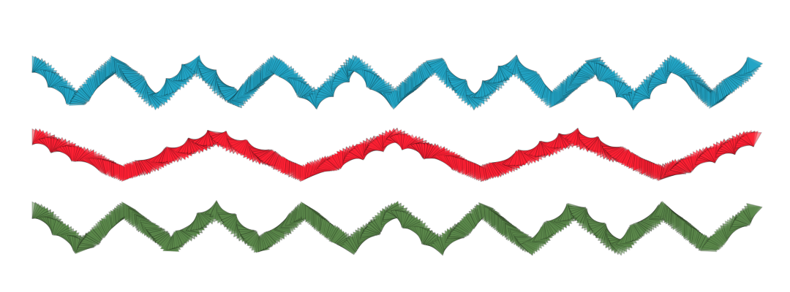
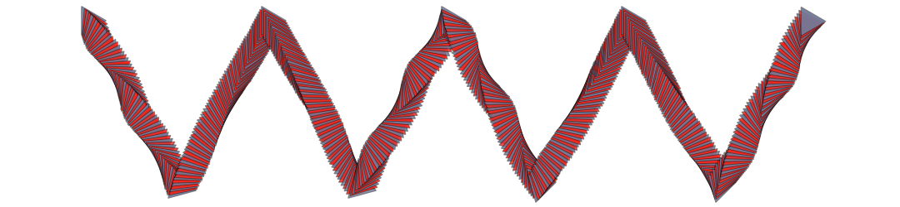

# Linear Splines

Connect a sequence of points using lines, like a line graph.



### Brush Method <a id="overview"></a>

**`brush.paintLinearSplines(layer, points, closed?)`**‌


While you can achieve something similar by manually painting a sequence of line segments, the linear splines method flattens the all splines into a _single_ array of points, which the brush strokes in a single pass.


### ‌Parameters‌‌ <a id="parameters"></a>

1. **points** - sequence of points to stroke
2. **closed** - if `true`, the last point will be connected to the first point

| Name | Type/s | Examples |
| :--- | :--- | :--- |
| points | `Array<Vector|Array|Object>` | `[new Vector(x, y)]`, `[[x, y]]`, `[{x, y}]` |
| closed | `boolean?` | `true`, `null` |

### Example

#### Paint a horizontal zigzag

```javascript
class LinearSplinesExample extends Design {
    async draw(layer) {
        let brush = new PolygonBrush()
        let colors = this.random.colors(2)
        
        brush.radius = 0.035
        brush.density = 12
        brush.tip.angle = (i, j, n, m) => (2 * PI) * sin(2 * PI * (i/(n-1)))
        brush.tip.stroke.width = this.random.real(0.002, 0.003)
        brush.tip.stroke.alpha = 0.5
        brush.tip.fill.color = (i) => colors[i % colors.length]
        brush.tip.fill.alpha = {min: 0.75, max: 1.0}
        
        let n = 10
        let dx = layer.width / n
        let dy = layer.height * 0.4
        let points = []
        
        for (let i = 0; i < n - 1; i++) {
          points.push({
            x: dx * (i + 1),
            y: layer.center.y + dy * (i % 2 ? 1 : -1)
          })
        }
        
        brush.paintLinearSplines(layer, points)
    }
}
```





