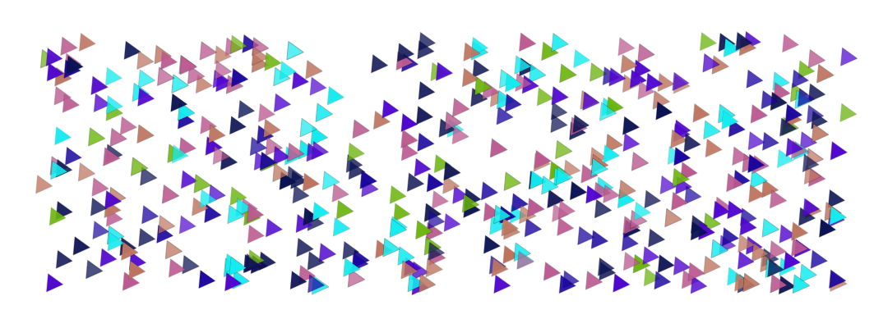
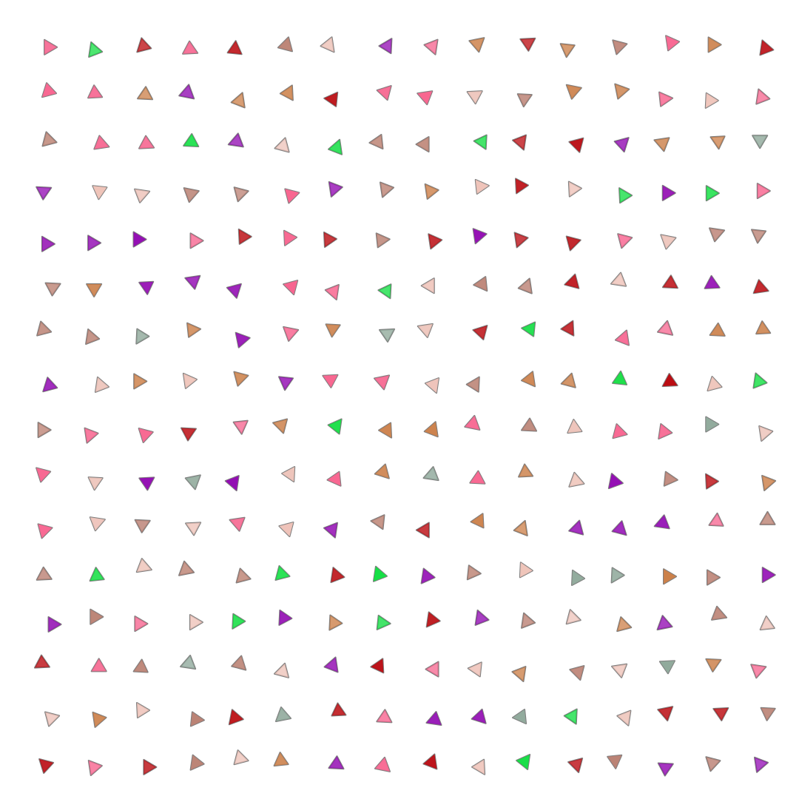

# Point Arrays



### Brush Method <a id="overview"></a>

**`brush.paintPointArray(layer, points)`**

### ‌Parameters‌

1. **point** - array of points at which the brush is drawn

| Name | Type/s | Examples |
| :--- | :--- | :--- |
| points | `Array<Vector|Array|Object>` | `[new Vector(x, y)`, `[x, y]`, `{x, y}]` |

### Example

#### Paint a grid of points with a point array

```javascript
class PointArrayExample extends Design {
    async draw(layer) {
        let brush = new PolygonBrush()
        let colors = this.random.colors(2)

        brush.density = 1
        brush.radius = 0.015
        brush.tip.fill.color = this.random.colors(2, 10)
        brush.tip.scattering.x = {min: 0, max: 0.025}
        brush.tip.scattering.y = {min: 0, max: 0.025}
        brush.tip.angle = (i, j, n, m) => 2 * PI * sin(2 * PI * (i/n))
        brush.tip.stroke.width = this.random.real(0.002, 0.003)
        brush.tip.stroke.alpha = 0.5
        brush.tip.fill.color = (i) => colors[i % colors.length]
        brush.tip.fill.alpha = {min: 0.75, max: 1.0}
        
        let n = 15
        let dx = layer.width / n
        let dy = layer.height * 0.4
        let points = []
        
        let n = Math.round(layer.height / (layer.height * brush.radius))
        let m = Math.round(layer.width / (layer.width * brush.radius))
        let dx = layer.width / m
        let dy = layer.height / n
        
        for (let i = 4; i < n; i += 4) {
          for (let j = 4; j < m; j += 4) {
            brush.angle = this.random.radians()
            points.push({ x: j * dx, y: i * dy })
          }
        }
        
        brush.paintPointArray(layer, points)
    }
}
```



