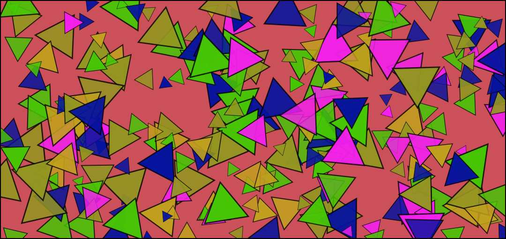

# Arrays of Points

Paint at each point in a list of points.



### Brush Method <a id="overview"></a>

**`paintPoints(layer, points)`**

### ‌Parameters‌

1. **point** - array of points at which the brush is drawn

| Name | Type/s | Example |
| :--- | :--- | :--- |
| points | `Array<Vector|Array|Object>` | `[new Vector(x, y)`, `[x, y]`, `{x, y}]` |

### Example

#### Paint an Array of Points

```javascript
const p1 = {x: 10, y: 10}
const p2 = {x: 50, y: 45}

brush.paintPoints(layer, [p1, p2])
```

