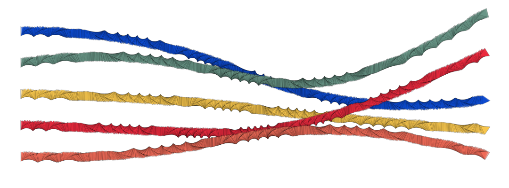

# Bezier Curves

Draw a cubic Bezier curve between two points, using two control points.



### Brush Method

**`brush.paintBezierCurve(layer, start, cp1, cp2, end)`**

### Parameters

* **start** - starting point of line segment
* **cp1** - first control point
* **cp2** - second control point
* **end** - end point of line segment

| Name | Type/s | Example/s |
| :--- | :--- | :--- |
| start | `Vector`, `Array`, `Object` | `new Vector(x, y)`, `[x, y]`, `{x, y}` |
| cp1 | `Vector`, `Array`, `Object` | `new Vector(x, y)`, `[x, y]`, `{x, y}` |
| cp2 | `Vector`, `Array`, `Object` | `new Vector(x, y)`, `[x, y]`, `{x, y}` |
| end | `Vector`, `Array`, `Object` | `new Vector(x, y)`, `[x, y]`, `{x, y}` |

### Example

#### Paint a single Bezier curve

```javascript
const start = {x: 10, y: 10}
const end = {x: 200, y: 50}
const cp1 = {x: 20, y: 30}
const cp2 = {x: 160, y: 10}

brush.paintBezierCurve(layer, start, cp1, cp2, end)
```


