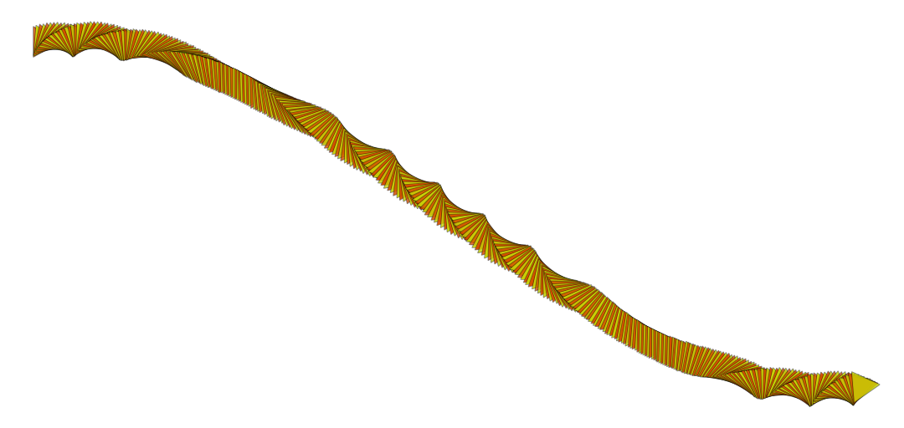

# Bezier Curves


### Brush Method

**`brush.paintBezierCurve(layer, start, cp1, cp2, end)`**

### Parameters

* **start** - starting point of line segment
* **cp1** - first control point
* **cp2** - second control point
* **end** - end point of line segment

| Name | Type/s | Examples |
| :--- | :--- | :--- |
| start | `Vector`, `Array`, `Object` | `new Vector(x, y)`, `[x, y]`, `{x, y}` |
| cp1 | `Vector`, `Array`, `Object` | `new Vector(x, y)`, `[x, y]`, `{x, y}` |
| cp2 | `Vector`, `Array`, `Object` | `new Vector(x, y)`, `[x, y]`, `{x, y}` |
| end | `Vector`, `Array`, `Object` | `new Vector(x, y)`, `[x, y]`, `{x, y}` |

### Example

#### Paint a single Bezier curve

```javascript
class BezierCurveExample extends Design {
    async draw(layer) {
        let brush = new PolygonBrush()
        let colors = this.random.colors(2)
        
        brush.radius = 0.035
        brush.density = 10
        brush.tip.angle = (i, j, n, m) => 2 * PI * sin(2 * PI * (i/n))
        brush.tip.stroke.width = this.random.real(0.002, 0.003)
        brush.tip.stroke.alpha = 0.5
        brush.tip.fill.color = (i) => colors[i % colors.length]
        brush.tip.fill.alpha = {min: 0.75, max: 1.0}
        
        let start = {x: 50, y: 50}
        let end = {x: layer.width - 50, y: layer.height - 50}
        let cp1 = {x: layer.center.x * 2/3, y: 0}
        let cp2 = {x: layer.center.x * 4/3, y: layer.height}
        
        brush.paintBezierCurve(layer, start, cp1, cp2, end)
    }
}
```



