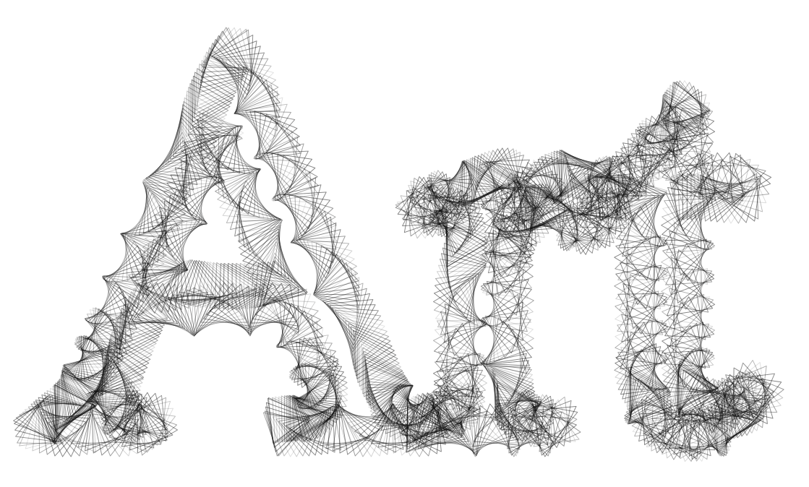

# Font Glyphs



### Brush Method <a id="overview"></a>

**`brush.paintGlyphs(layer, text, fontName, fontSize, center)`**

### ‌Parameters‌

1. **text** - One or more characters \(font glyphs\) to stroke
2. **fontName** - Base file name of a font file contained in the top-level `fonts` directory
3. **fontSize** - Size of the font in pixels, which corresponds to the font height.
4. **center** - center position at which the path is drawn

| Name | Type/s | Examples |
| :--- | :--- | :--- |
| text | `string` | `"quantum"`, `"浮"`  |
| fontName | `string` | `"umeboshi"` |
| fontSize | `integer` | `22`, `50` |
| center | `Vector`, `Array`, `Object` | `[new Vector(x, y)]`, `[[x, y]]`, `[{x, y}]` |


Reactor auto-loads fonts in the top-level `fonts` directory. If you have a font called `my-font.ttf`, then you can reference this font by name, like `"my-font"`.



In addition to being able to paint glyphs, glyphs can be used as a brush tip with the [`GlyphBrush`](../brush-properties/brush-types/glyph-brush.md) type.


### Example

#### Stroke the characters `["L", "S", "D"]`

```javascript
class GlyphExample extends Design {
    async draw(layer) {
        let brush = new PolygonBrush()
        let colors = this.random.colors(2)

        brush.radius = this.random.real(0.01, 0.1)
        brush.density = this.random.real(1, 20)
        brush.steps = 4
        brush.tip.angle = (i, j, n, m) => 2 * PI * sin(2 * PI * (i/n))
        brush.tip.scale = (i, j, n, m) => 1 / (0.2 * j + 1)
        brush.tip.stroke.width = this.random.real(0.002, 0.003)
        brush.tip.stroke.alpha = 0.5
        brush.tip.fill.color = (i) => colors[i % colors.length]
        brush.tip.fill.alpha = {min: 0.75, max: 1.0}
        
        if (this.random.flip()) {
          let p = this.random.real()  // btw 0..1
          brush.tip.fill.probability = (i, j) => i % 2 ? 0 : p
        } else {
          brush.tip.fill.probability = 1
        }
        
        let text = 'LSD'
        let font = 'umeboshi'
        let size = layer.height * 0.8
        let position = {x: 200, y: layer.height - 200}
        
        brush.paintGlyphs(layer, text, font, size, position)
    }
}
```


