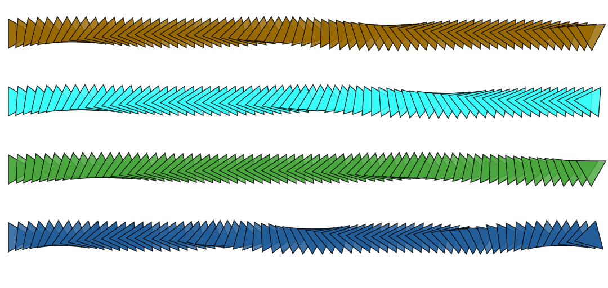

# Line Segments

Stroke a straight line between start and end points.



### Brush Method

**`paintLine(layer, start, end)`**

### Parameters

* **start** - starting point of line segment
* **end** - end point of line segment

| Name | Type/s | Example/s |
| :--- | :--- | :--- |
| start | `Vector`, `Array`, `Object` | `new Vector(x, y)`, `[x, y]`, `{x, y}` |
| end | `Vector`, `Array`, `Object` | `new Vector(x, y)`, `[x, y]`, `{x, y}` |

### Example

#### Paint a Single Line Segment

```javascript
const start = {x: 10, y: 10}
const end = {x: 200, y: 50}

brush.paintLine(layer, start, end)
```


