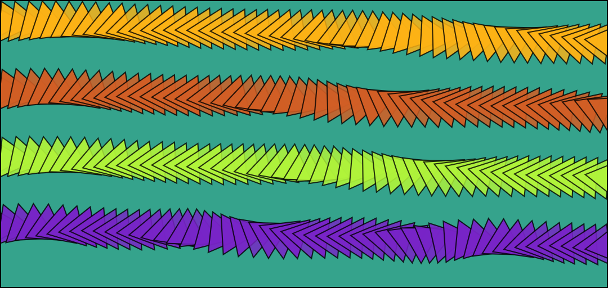

# Lines

### Overview

* Type Name: `"line"`
* Call Convention: `brush.paintLine(layer, start, end)`

### Parameters

* **start** - starting point of line segment
* **end** - end point of line segment

| Name | Type/s | Example/s |
| :--- | :--- | :--- |
| start | `Vector`, `Array`, `Object` | `new Vector(x, y)`, `[x, y]`, `{x, y}` |
| end | `Vector`, `Array`, `Object` | `new Vector(x, y)`, `[x, y]`, `{x, y}` |

