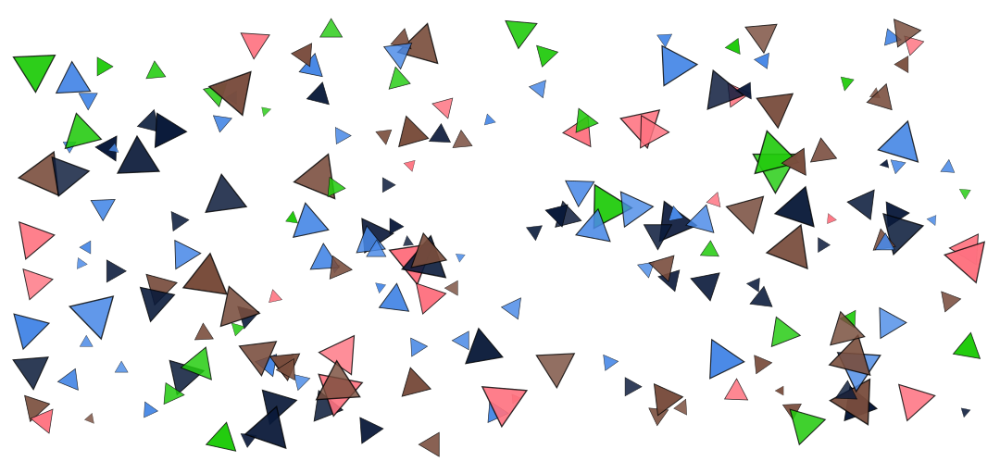

# Single Points

Paint at a specific location.



### Brush Method <a id="overview"></a>

**`paintPoint(layer, point)`**


If you have a large set of points, use the`paintPoints` method. See: [Arrays of Points](arrays-of-points.md) 


### ‌Parameters‌

1. **point** - point at which the brushstroke is drawn

| Name | Type/s | Example/s |
| :--- | :--- | :--- |
| point | `Vector`, `Array`, `Object` | `new Vector(x, y)`, `[x, y]`, `{x, y}` |

### Example

#### Paint One Point

```javascript
const point = {x: 100, y: 250}

brush.paintPoint(layer, point)
```

