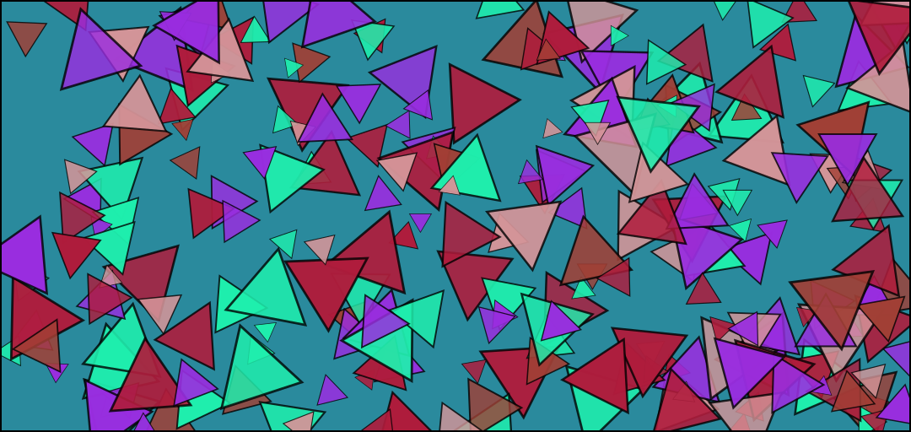

# Points

### Overview‌ 

* **Type Name**: `"point"`
* **Call Convention**: `brush.paintPoint(layer, point)`

### ‌Parameters‌

1. **point** - point at which the brushstroke is drawn

| Name | Type/s | Example/s |
| :--- | :--- | :--- |
| point | `Vector`, `Array`, `Object` | `new Vector(x, y)`, `[x, y]`, `{x, y}` |

