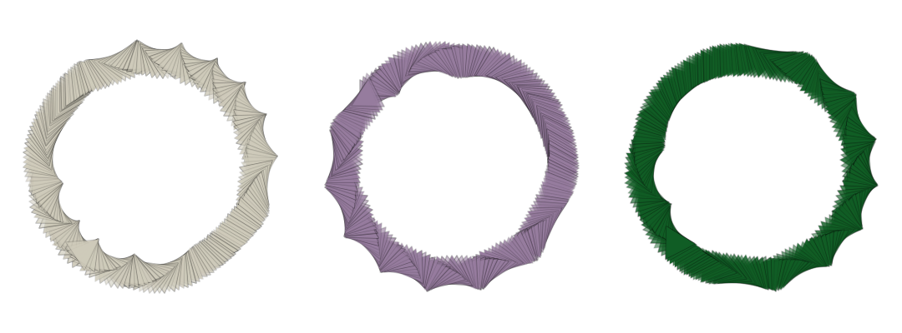
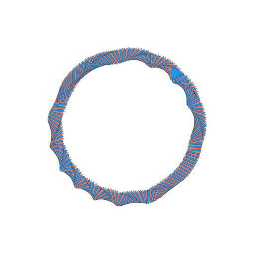

# Rings

Draw a ring with evenly spaced points along the circumference, regardless of brush density.



### Brush Method <a id="overview"></a>

**`brush.paintRing(layer, center, radius, angle?)`**

### Parameters <a id="parameters"></a>

1. **center** - center point of ring
2. **radius** - radius of ring, expressed in fraction of layer radius \(0.2 means 20% of layer radius\)
3. **angle** - angle, rotated from 0 , at which initial point in ring path is drawn 

| Name | Type/s | Examples |
| :--- | :--- | :--- |
| center | `Vector`, `Array`, `Object` | `new Vector(x, y)`, `[x, y]`, `{x, y}` |
| radius | `float` | `0.20  (% layer width)` |
| angle | `float?` | `2/3 * Math.PI  (radians)`, `null` |

### Example

#### Paint a ring centered on layer

```javascript
class RingExample extends Design {
    async draw(layer) {
        let brush = new PolygonBrush()
        let colors = this.random.colors(2)
        
        brush.radius = 0.045
        brush.density = 10
        brush.tip.angle = (i, j, n, m) => 2 * PI * sin(2 * PI * (i/n))
        brush.tip.stroke.width = this.random.real(0.002, 0.003)
        brush.tip.stroke.alpha = 0.5
        brush.tip.fill.color = (i) => colors[i % colors.length]
        brush.tip.fill.alpha = {min: 0.75, max: 1.0}
        
        let center = layer.center
        let radius = 0.4
        let angle0 = this.random.radians()
        
        brush.paintRing(layer, center, radius, angle0)
    }
}
```



