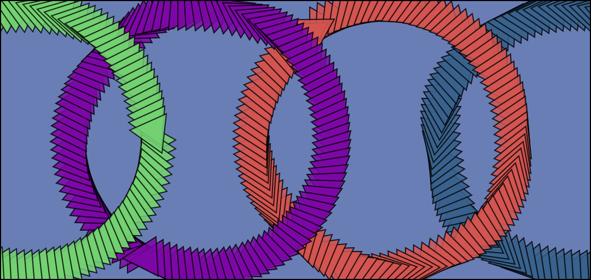

# Rings

### Overview‌ 

* Type Name: `"ring"`
* Call Convention: `brush.paintRing(layer, center, radius, angle)`

### Parameters 

1. **center** - center point of ring
2. **radius** - radius of ring, expressed in fraction of layer radius \(0.2 means 20% of layer radius\)
3. **angle** - angle, rotated from 0 , at which initial point in ring path is drawn 

| Name | Type/s | Example/s |
| :--- | :--- | :--- |
| center | `Vector`, `Array`, `Object` | `new Vector(x, y)`, `[x, y]`, `{x, y}` |
| radius | `float` | `0.20  (% layer width)` |
| angle | `float` | `2/3 * Math.PI  (radians)` |

