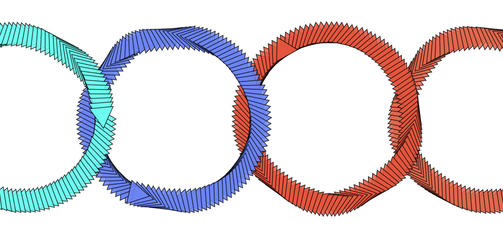

# Rings

Draw a ring with evenly spaced points along the circumference, regardless of brush density.



### Brush Method <a id="overview"></a>

**`paintRing(layer, center, radius, angle?)`**

### Parameters <a id="parameters"></a>

1. **center** - center point of ring
2. **radius** - radius of ring, expressed in fraction of layer radius \(0.2 means 20% of layer radius\)
3. **angle** - angle, rotated from 0 , at which initial point in ring path is drawn 

| Name | Type/s | Example/s |
| :--- | :--- | :--- |
| center | `Vector`, `Array`, `Object` | `new Vector(x, y)`, `[x, y]`, `{x, y}` |
| radius | `float` | `0.20  (% layer width)` |
| angle | `float?` | `2/3 * Math.PI  (radians)`, `null` |

### Example

#### Paint a Ring Centered on Layer

```javascript
const center = layer.center
const radius = 0.4  // 40% canvas radius
const angle = 1/2 * Math.PI  // starting angle

brush.paintRing(layer, center, radius, angle)
```

