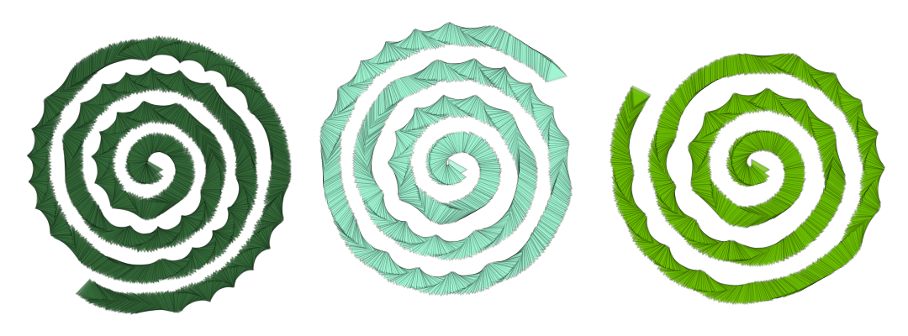
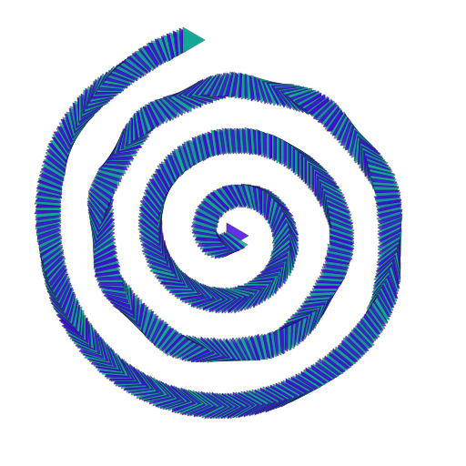

# Spirals

Draw a spiral, according to its desired position, radius, and coils, i.e. number full rotations.



### Brush Method

**`brush.paintSpiral(layer, center, radius, coils, angle?)`**

### Parameters

1. **center** - center point of ring
2. **radius** - radius of ring, expressed in percentage of layer radius \(0.2 means 20% of layer radius\)
3. **coils** - the number of levels or coils in the spiral
4. **angle** - angle, rotated from 0 , at which initial point in ring path is drawn **\(not yet implemented\)**

| Name | Type/s | Examples |
| :--- | :--- | :--- |
| center | `Vector`, `Array`, `Object` | `new Vector(x, y)`, `[x, y]`, `{x, y}` |
| radius | `float` | `0.5  (% layer width)` |
| coils | `float` | `2.5` |
| angle | `float?` | `2/3 * Math.PI  (radians)` |

### Example

#### Paint a Spiral Centered on Layer

```javascript
class SpiralExample extends Design {
    async draw(layer) {
        let brush = new PolygonBrush()
        let colors = this.random.colors(2)
        
        brush.radius = 0.035
        brush.density = 12
        brush.tip.angle = (i, j, n, m) => (2 * PI) * sin(2 * PI * (i/(n-1)))
        brush.tip.stroke.width = this.random.real(0.002, 0.003)
        brush.tip.stroke.alpha = 0.5
        brush.tip.fill.color = (i) => colors[i % colors.length]
        brush.tip.fill.alpha = {min: 0.75, max: 1.0}
        
        let center = layer.center
        let radius = 0.6
        let coils = this.random.real(2, 5)
        
        brush.paintSpiral(layer, center, radius, coils)
    }
}
```



