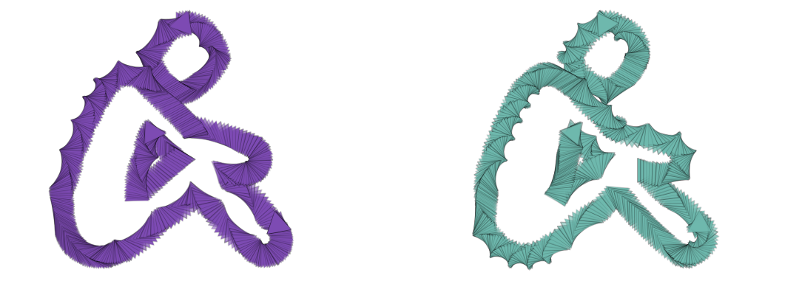

# SVG Paths

Trace an SVG path, i.e. the "d" value of a `<path d="M....">` SVG element.



### Brush Method <a id="overview"></a>

**`brush.paintSvgPath(layer, path, center, scale)`**

### ‌Parameters‌

1. **path** - raw SVG path string \(i.e. the value of the "d" attribute of the path element\)
2. **center** - center position at which the path is drawn
3. **scale** - scale with which the path is drawn

| Name | Type/s | Examples |
| :--- | :--- | :--- |
| path | `string` | `"M123,45...."` |
| center | `Vector`, `Array`, `Object` | `[new Vector(x, y)]`, `[[x, y]]`, `[{x, y}]` |
| scale | `float` | `0.5`, `1.0`, `5.0` |


Reactor is aware of path text files located in `svg/paths` directory. If you have a path file called "foo", then you'll be able to load this file at runtime via `reactor.svgManager.getPath("foo")`.


### Example

#### Paint an Array of Points

```javascript
const reactor = Reactor.getInstance()
const pathString = reactor.svgManager.getPath('foo')
const center = layer.center
const scale = 2.0

brush.paintSvgPath(layer, pathString, center, scale)
```

